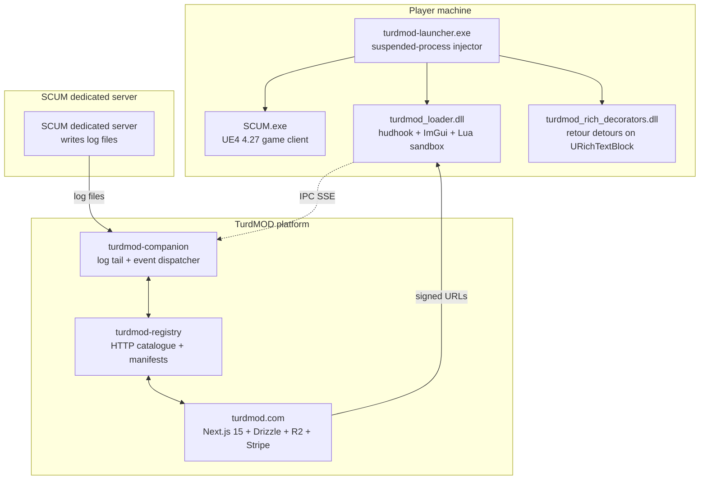

<p align="center">
  <h1 align="center">TurdMOD</h1>
  <p align="center"><em>The modding engine SCUM should have shipped with.</em></p>
</p>

<p align="center">
  <a href="https://github.com/roketteere/turdmod/blob/main/LICENSE"></a>
  <a href="https://github.com/roketteere/turdmod/commits/main"></a>
  <a href="https://github.com/roketteere/turdmod/stargazers"></a>
  <a href="https://github.com/roketteere/turdmod/issues"></a>
  
</p>

<p align="center">
  
  
  
  
  
  
  
</p>

<p align="center">
  
  
  
  
  
  
  
</p>

<p align="center">
  <a href="https://turdmod.com"></a>
  <a href="https://discord.gg/turdmod"></a>
  
  
  
  
</p>

<p align="center">
  TurdMOD is a first-party modding engine and marketplace for SCUM, the open-world survival game by Gamepires. It's the
  in-game UI loader, the server-side runtime, the mod catalogue, the payments pipeline, and the developer portal —
  built modern from day one and shipped together. TurdMOD is not affiliated with Gamepires or KRAFTON.
</p>

---

## What is this

TurdMOD is to SCUM what **uMod** is to Rust, what **Thunderstore** is to the BepInEx games, and what **CurseForge** is to Minecraft — a single ecosystem that covers the engine, the catalogue, the payouts, and the install path. It exists because SCUM has had a thriving private-server modding community for years with no first-party tooling, no signed artefact distribution, and no way for mod authors to get paid for the work.

The engine has two halves. A **server-side runtime** (`turdmod-companion`) tails SCUM dedicated server logs, parses gameplay events, and dispatches them to TypeScript mod scripts — no client install required. A **client-side loader** (`turdmod-loader`) is a Rust DLL injected into `SCUM.exe` that hosts a Lua sandbox, an ImGui DX11 overlay via `hudhook`, and an in-process detour engine that augments stock UE4 widgets with modern markup support.

TurdMOD targets **solo, private, and modded servers only**. It is never intended to run against official BattlEye-protected servers and ships with a sentinel that refuses to attach in that context. No cheats, no anti-cheat bypasses, no kernel work — anything in this repo that goes near official multiplayer is a bug.

## At a glance

-  **Marketplace** at [turdmod.com](https://turdmod.com) — browse, buy, subscribe (test mode)
-  **Server-side runtime** that tails SCUM dedicated server logs and dispatches events to mod scripts
-  **In-game UI loader** in Rust, using `hudhook` + Dear ImGui (DX11) and a Lua 5.4 sandbox per mod
-  **Rich-text decorator DLL** — `retour-rs` inline detours on `URichTextBlockImageDecorator` for inline ``, `<a/>`, `<dismiss/>` markup
-  **Discord OAuth sign-in** via NextAuth on the web app
-  **Cloudflare R2** mod artifact CDN with signed-URL downloads
-  **Stripe payments** — 12% platform fee, **88% to creators**, monthly payouts
-  **TurdMOD Premium** — $9.99/mo subscription tier covering bundled first-party mods

## First-party mods

The launch suite. All authored by **Joel Perez (TurdMOD Admin)**. Live in the catalogue at [turdmod.com/mods](https://turdmod.com/mods).

| Mod | Tag | Idea | Summary |
|---|---|---|---|
| **Welcome Screen** | UI | — | Branded in-game panel that announces what mods your server is running, with a dismiss button you actually want to read. *(Discord half ships now; in-game panel needs Engine.)* |
| **Killfeed** | HUD | — | Minimal kill ticker that respects the SCUM aesthetic — weapon, distance, headshot — without streamer-overlay clutter. |
| **Squad-Mate** | Squad | — | Combined squad list + voice-status indicator. Replaces two community plugins with one cohesive panel and a single keybind. |
| **Teleport** | Admin | — | Saved waypoints, party teleport, and per-server cooldown ledger. Admin-gated by default, opt-in for trusted players. *(Engine-gated — preview only on stock SCUM today.)* |
| **Companion** | Gameplay | — | Adopt an in-game animal as a follower. Persists across logout, defends owner, gets sad when you abandon it. Vanilla AI. |
| **Survivor Rescue** | Gameplay | — | Subdue a zombie, walk it to a base, "rescue" it into a friendly NPC. Saved per-server, optional traits, fully reversible. |
| **MapZoom** | Map | Idea by **HELLZONE** | Pinch / wheel zoom on the in-game map down to individual sectors. Sector grid stays crisp at every level; remembers your last view. |
| **DropPin** | Map | — | Drop colored, named pins on the map. HUD bearing strip points the way; manual-dismiss by default with optional auto-clear by radius. |
| **VehicleControls** | Vehicle | Idea by **Zilla** & **HELLZONE** | Cancel a vehicle entry mid-animation, close the door with the engine off, decompose entry into discrete steps. |
| **Patrols & Bandits** | NPC | — | Police patrols on roads + town centers; bandit gangs that ambush, hold you up, take a tax, rough you up, and walk away. Configurable density + encounter cooldowns. |
| **EventsManager** | Events | Idea by **user G** (Scum Dumpster) | Complete server-events toolkit — scheduled spawn waves, supply drops, weather + time-of-day scripts, raid windows, PVP/PVE toggles, calendar UI, presets, audit log, Lua hook. |

## Quick start

### Try the marketplace (users)

1. Visit **[turdmod.com](https://turdmod.com)**
2. Sign in with Discord
3. Browse `/mods`, subscribe to Premium at `/premium`, or grab individual mods
4. Follow the per-mod install guide (linked from each detail page)

### Build with the engine (developers)

```bash
git clone https://github.com/roketteere/turdmod.git
cd turdmod
pnpm install
```

Then per-app:

```bash
pnpm --filter @turdmod/turdmod-companion dev   # server-side runtime (log tail + event bus)
pnpm --filter @turdmod/turdmod-cli build       # operator CLI: turdmod doctor / scaffolding
pnpm --filter @turdmod/turdmod-web dev         # marketplace web app on a free port
```

Rust pieces build per-app:

```bash
cargo build --release --manifest-path apps/turdmod-loader/Cargo.toml
cargo build --release --manifest-path apps/turdmod-loader/decorators/Cargo.toml
cargo build --release --manifest-path apps/turdmod-loader/launcher/Cargo.toml
# turdmod-service — the live-server runtime (50+ mod modules, named-pipe RPC to the engine bridge)
cargo build --release --manifest-path apps/turdmod-service/Cargo.toml
```

The **live modded server** (www.ScummyMap.com) runs `turdmod-service` as a Windows
service (`TurdMODService`) alongside the SCUM dedicated server + the in-process engine
bridge. Deploy = `scp` the release binary to the host, broadcast a restart countdown,
`Stop-Service` → swap → `Start-Service`, then `POST :9090/server/start`. Operator details
(hosts, service API token, bridge access) are in `CLAUDE.md` + `.secrets/credentials.md`.

> Operational credentials (deploy targets, signing keys, webhooks) live in `.secrets/credentials.md`, which is gitignored and local-only. You don't need it to build — only to deploy `turdmod.com`.

## Architecture



The full layered map (event flow, IPC payloads, decorator detour timing) is in [`docs/turdmod/ARCHITECTURE.md`](docs/turdmod/ARCHITECTURE.md). Read that first when re-orienting.

## Components

| Path | Stack | Role |
|---|---|---|
| `apps/turdmod-web` | Next.js 15, React 19, Drizzle ORM, MariaDB (mysql2), Cloudflare R2 (AWS SDK v3), Stripe, NextAuth (Discord OAuth), Tailwind | turdmod.com — marketplace, docs, dev portal, community home. Deployed to Spaceship Pro Web (cPanel + Passenger Node 22). |
| `apps/turdmod-companion` | TypeScript (Node 20+) | Server-side runtime: tails SCUM dedicated-server logs, parses events, dispatches them to mod scripts (welcome banners, kill feeds, vehicle alerts, squad management, …). |
| `apps/turdmod-loader` | Rust cdylib (`hudhook` 0.9, `mlua` 0.10 / Lua 5.4, `windows-sys`, `ureq`) | Client-side DLL injected via dxgi-proxy. Provides Lua sandbox, IPC subscriber, hudhook + ImGui DX11 in-game panels. BattlEye-disabled servers only. |
| `apps/turdmod-loader/decorators` | Rust cdylib (`retour` 0.3, `image`, `windows-sys`) | Sibling DLL: function-detours engine-stock `URichTextBlockImageDecorator` + `URichTextBlockActionPromptDecorator` to add ``, `<a href/>`, `<dismiss key/>` markup. |
| `apps/turdmod-loader/launcher` | Rust exe | Suspended-process DLL injector. Launches SCUM and side-loads the loader + decorator DLLs in one shot. |
| `apps/turdmod-cli` | TypeScript (Node 20+, commander) | Operator CLI: `turdmod doctor`, mod manifest scaffolding, build-diff cross-reference for SCUM patches. |
| `apps/turdmod-registry` | TypeScript (Node 20+) | HTTP registry serving the public mod catalogue + per-server mod manifests. |
| `apps/turdmod-guard` | Rust + TypeScript | BattlEye/sentinel: refuses to attach when an official-server context is detected. |
| `packages/turdmod-api` | TypeScript | Shared types for mod scripts, runtime payloads, registry responses. |
| `packages/turdmod-manifest` | TypeScript (Zod) | `turdmod.json` schema + validators. |
| `examples/turdmod/*` | TypeScript | Reference mods: `welcome-screen`, `kill-feed`, `vehicle-manager`, `my-squad`, `cosmetic-icon-pack`. Mix of server-only mods (shippable today via companion log-tail) and Engine-gated mods (preview status until the TurdMOD Engine DLL ships). Each mod's README declares which bucket it falls into — see [`docs/SHIP-STATUS.md`](docs/SHIP-STATUS.md) for the full matrix. |
| `examples/turdmod-design-stage/*` | TypeScript | Lua-runtime-targeted mods (parked pending loader Phase B completion). |
| `docs/turdmod/` | Markdown | Architecture map, manifest spec, CUI extension spec, manager UI spec. |
| `docs/scum-internals/` | Markdown | Reverse-engineering reference: memory signatures, UClass layouts, log shapes, custom-content surfaces. |
| `scripts/` | PowerShell | One-shot operator scripts (decorator probe live-test, deploy, etc.). |
| `tools/` | PowerShell | Branding + maintenance tools. |

## The marketplace

[turdmod.com](https://turdmod.com) is live in test mode and runs on the same monorepo. The web app is `apps/turdmod-web`.

- **`/mods`** — browse and buy individual mods
- **`/dev`** — author dashboard. Submit mods, manage versions, see install + revenue stats. Creators receive **88%** of every sale; payouts run monthly via Stripe Connect
- **`/premium`** — $9.99/mo subscription. Currently bundles **Companion**, **Survivor Rescue**, and **VehicleControls**
- **`/docs`** — engine API reference, manifest spec, getting-started tutorials
- **`/community`** — Discord, code of conduct, contribution guidelines

## Deploying turdmod.com

```bash
./scripts/deploy-turdmod-web.sh
```

Builds the Next.js standalone bundle, flattens pnpm's `.pnpm/` store into a real `node_modules/` (necessary for prod resolution), tars, scp's to Spaceship cPanel, and triggers a Passenger restart. Server-side `.env.production.local` is preserved across deploys — populate it once with the values from `.secrets/credentials.md` before the first run.

## Status & roadmap

### Shipped

- **Phase A (server-side mods)** — four reference mods polished and verified: `welcome-screen`, `kill-feed`, `vehicle-manager`, `my-squad`. Companion runtime + verify CLI shipped.
- **Phase B step 1 (engine resolution)** — decorator DLL resolves `URichTextBlock*Decorator` UClasses + their CDOs against live SCUM 23128448 via FName / `GUObjectArray` walk; vtable-diff identifies the `CreateDecorator` slot.
- **Phase B step 2a (detour install)** — `retour`-managed inline detours installed on both child decorator classes' `CreateDecorator` vtable entries; detours verified live, SCUM stable past the patch.
- **Phase C — TurdMOD Engine end-to-end build chain (2026-05-16)** — every layer from UEPseudo open-source header reconstruction down to a running cppmod compiles cleanly:
  - `UE4SS.dll` (6 MB) + `UE4SS.lib` built from `tools/ue4ss-headers-gen/` (UEPseudo reconstruction v0.28, 376 errors → 0 across one session)
  - `TurdMODEngineBridge.dll` — UE4SS cppmod, registers RPC handlers on `on_unreal_init`, resolves loader exports via `GetProcAddress`, emits `bridgeReady` event
  - `turdmod_server_loader.dll` (1.3 MB) — exports all 4 required C-ABI symbols (verified via dumpbin), hosts the named-pipe RPC server, 9/9 admin_api tests pass
  - `scripts/engine-smoke.ps1` — one-shot PowerShell that installs the DLLs into a target SCUMServer install and launches via `turdmod-launcher` with three-stream log tail
  - **Manager engine controls** — Tauri commands `engine_install` / `engine_start` / `engine_stop` / `engine_get_status` in `apps/turdmod-manager/src-tauri/`; new Engine section in the Manager's `EnginePage.tsx` with install button + status pill + paths display
  - **Multi-stream ConsolePage** — companion stdout + ue4ss.log + loader.log unified, source-tagged, filterable per stream/level
- **Phase C step 2 — Engine reflection LIVE + admin handler suite (2026-05-16)** — every state-changing bridge handler goes from stub to verified-working against a live SCUM dedicated server:
  - **Engine reflection layer** — `UnrealInitializer::Initialize` reproduced via `patternsleuth_bind` FFI; 1.5M live UObjects walkable through `ForEachUObject`; cross-DLL static mirror pattern lets the bridge cppmod see UE4SS-armed addresses (commit `71b6512`)
  - **broadcastChat** — verified end-to-end; companion → RPC → `MiscStatics::BroadcastChatLine` → in-game local chat (commit `a4c6c52`)
  - **getOnlinePlayers** — returns connected PCs with their actual display names via runtime FProperty walking, no hardcoded offsets (commits `bfc67cc`, `6ba2c8e`)
  - **teleportPlayer** — moves a connected player's pawn via `K2_TeleportTo` UFunction dispatch (commit `a7aaa42`)
  - **spawnVehicle** — `BeginDeferredActorSpawnFromClass` + `FinishSpawningActor` with live-read param offsets (commit `945458b`)
  - **Diagnostics: `dumpUFunctions` / `findFunctions` / `describeFunction`** — empirical UFunction inventory + signature dumping
  - **PolyHook2 ProcessEvent global hook** — catches every UFunction call for diagnostic logging + foundation for mod-level hook registration
- **Platform** — turdmod.com landing + first-party catalogue, Discord OAuth, marketplace DB schema, Stripe payments wired.

### In progress

- **Phase B step 2b (detour body)** — parse `FTextRunInfo.MetaData["src"]`, dispatch to image fetch + game-thread texture marshal so `` actually renders.
- **Player record enrichment** — getOnlinePlayers v3: add Steam ID (`APlayerState::UniqueId` / `FUniqueNetIdRepl` → string), current location (`Pawn->RootComponent->ComponentToWorld.Translation`), and health (`SCUM_CharacterFlags`-style UProperty). Same FProperty walker pattern as today's display-name resolution.
- **SCUM widget inventory (`dumpWidgets`)** — bridge already exposes `dumpUFunctions` and `findFunctions`; the parallel `dumpWidgets` RPC (walks `UUserWidget` subclasses in `GUObjectArray`) is the foundation for the UI/UX Maker below.

### What's next

- **UI/UX Maker (the moat)** — "Interface Builder for SCUM UI" inside the Manager. Mod authors pick from SCUM's existing UMG widgets in a browser, configure them visually, and emit a `UIIntent` (JSON) the bridge dispatches server-side. The player's stock client renders using SCUM's own fonts/styling — zero player install for any UI that uses widgets SCUM already ships. Phased: widget inventory → JSON DSL → hand-authored mode → visual editor → live preview-as-player. See [`IDEAS.md`](IDEAS.md) for the full phasing.
- **Welcome panel polish** — server-driven content via IPC, multi-page tabs (About / Mods / Commands / Help), custom emoji-capable font.
- **TurdMOD Manager (Tauri desktop)** — DZSALauncher-style "join server → it figures out the mods" experience: browse the registry, profile per server, one-click install, auto-update. Engine controls + Console already shipped; remaining work is registry browse, per-server profiles, auto-update.
- **Server admin dashboard** — server-owner web UI to buy premium mods, auto-deploy to their server via SCP/SFTP, manage license keys.
- **Author rewards beyond direct sale** — impression-share revenue for free mods that drive Premium signups.
- **OCR-based menu detection** — replace fixed wall-clock gates in the loader with a vision-driven menu state machine.

The full ideas log lives in [`IDEAS.md`](IDEAS.md) (append-only).

## Contributing

Issues and pull requests are welcome.

- Read the [code of conduct](https://turdmod.com/community) before opening a PR.
- **No cheats, no aimbots, no anti-cheat bypasses, no BattlEye work.** PRs touching official-server attach paths get closed on sight. The whole project depends on staying squarely on the legitimate-modding side of the line.
- New mods belong in `examples/turdmod/<your-mod>/` with a valid `turdmod.json` (validated by `packages/turdmod-manifest`).
- Run `pnpm typecheck` and `pnpm lint` before pushing.

## License

[MIT](LICENSE).

## Repo separation note

TurdMOD was originally developed inside the [scummymap monorepo](https://github.com/roketteere/scummymap) and split out on **2026-05-09**. The scummymap repo remains the home of the SCUM-game integration (interactive map, Discord bot, .NET extractor, Python tiler). This repo is the modding engine + marketplace only — no SCUM-game-content tooling.

## Acknowledgments

- **HELLZONE** — original idea for **MapZoom**.
- **a community contributor** — community contributor credited in the early overlay history that became this repo.
- **Gamepires** — for SCUM. Courtesy mention; TurdMOD is not affiliated with or endorsed by Gamepires or KRAFTON.
- The open-source projects this engine stands on:
  - [Next.js](https://nextjs.org) · [React](https://react.dev) · [Drizzle ORM](https://orm.drizzle.team) · [Tailwind CSS](https://tailwindcss.com)
  - [hudhook](https://github.com/veeenu/hudhook) · [Dear ImGui](https://github.com/ocornut/imgui) · [retour-rs](https://github.com/Hpmason/retour-rs) · [mlua](https://github.com/mlua-rs/mlua)
  - [NextAuth.js](https://authjs.dev) · [Stripe](https://stripe.com) · [Cloudflare R2](https://www.cloudflare.com/developer-platform/r2/)
